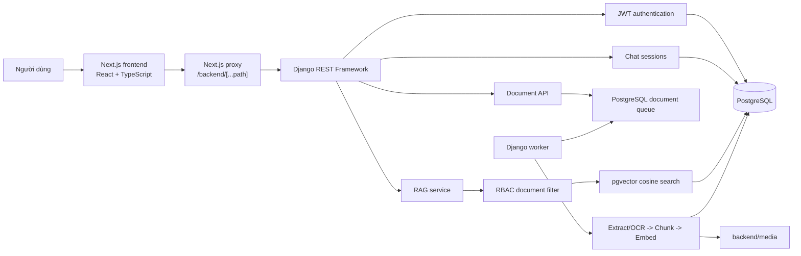
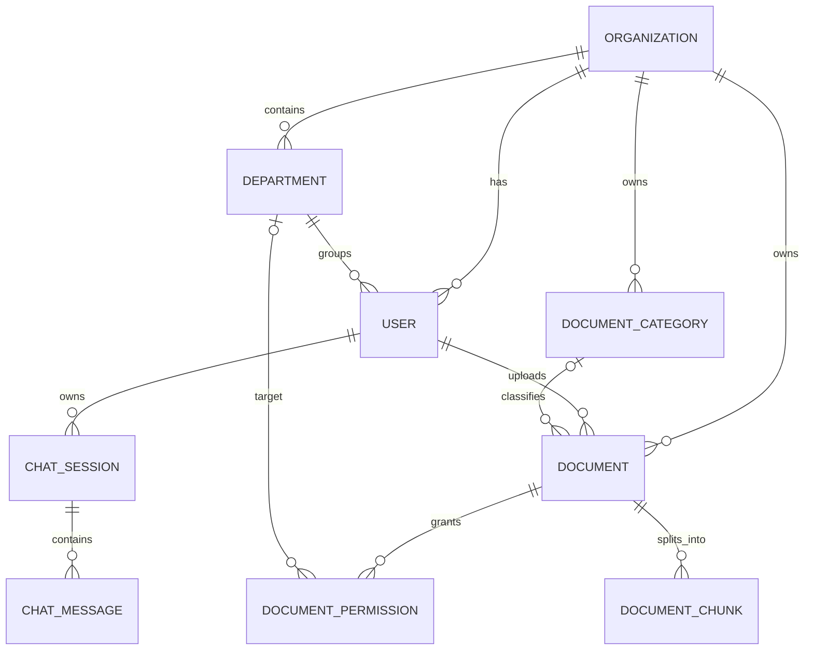
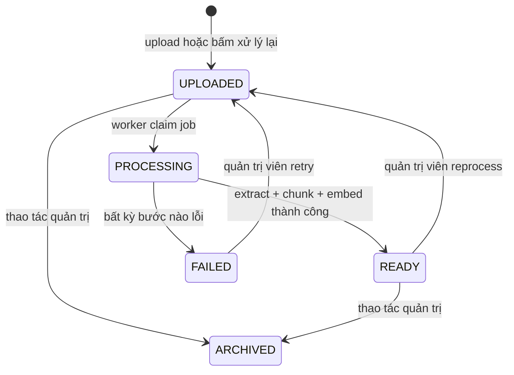
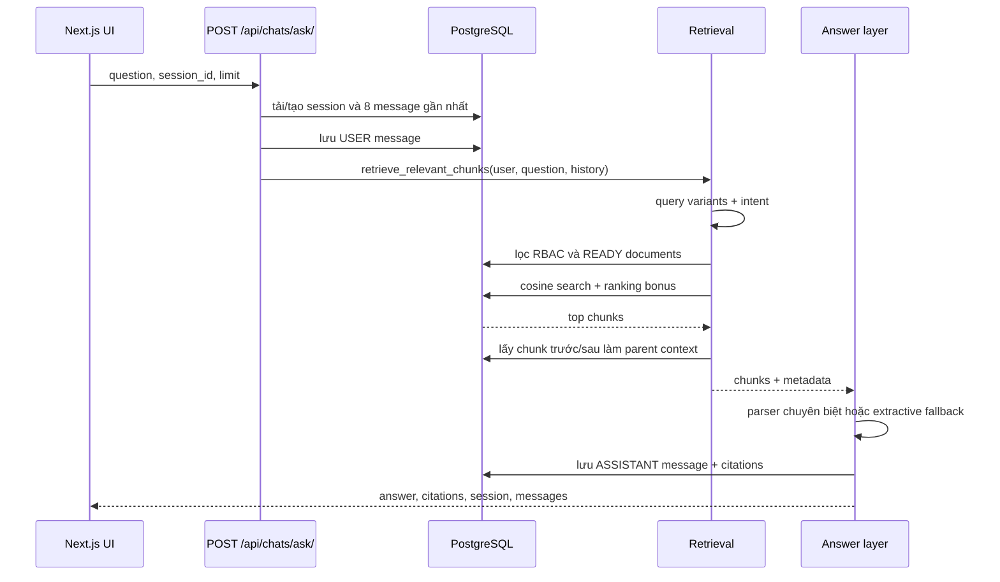

# Guide Toàn Bộ Hệ Thống Enterprise Knowledge RAG

Tài liệu này giải thích project theo góc nhìn của một sinh viên năm 4 đã biết
PostgreSQL, Django, ReactJS và AI cơ bản. Mục tiêu không chỉ là biết "file nào
làm gì", mà là có thể lần theo một request, tự debug, tự thay đổi tính năng và
trình bày lại cơ chế của đồ án.

> Phiên bản code được mô tả: ngày 12/08/2026. Khi code thay đổi, hãy ưu tiên
> code đang chạy và cập nhật lại guide nếu hợp đồng API hoặc pipeline đổi.

## 1. Cách Đọc Guide

Nếu cần hiểu nhanh trước khi demo, đọc theo thứ tự:

1. [Mô hình tư duy trong 10 phút](#2-mô-hình-tư-duy-trong-10-phút)
2. [Một câu hỏi đi qua hệ thống như thế nào](#13-một-câu-hỏi-đi-qua-rag-như-thế-nào)
3. [LangChain được dùng chính xác ở đâu](#19-langchain-được-dùng-chính-xác-ở-đâu)
4. [Frontend dành cho người đã học ReactJS](#21-frontend-dành-cho-người-đã-học-reactjs)
5. [Kiểm thử và đánh giá](#27-kiểm-thử-và-đánh-giá)

Nếu muốn làm chủ code, đọc lần lượt toàn bộ tài liệu và mở file được gắn link
ở đầu mỗi phần.

## 2. Mô Hình Tư Duy Trong 10 Phút

Hệ thống giải quyết bài toán sau:

> Một người dùng đăng nhập vào tổ chức của mình, đặt câu hỏi trên những tài
> liệu mình được phép xem, và nhận câu trả lời có nguồn trích dẫn.

Có ba luồng chính:

1. **Luồng quản trị dữ liệu**: upload PDF/DOCX, OCR nếu cần, chia chunk, tạo
   embedding, lưu vào PostgreSQL/pgvector.
2. **Luồng hỏi đáp**: nhận câu hỏi, lọc tài liệu theo RBAC, tìm chunk phù hợp,
   trích thông tin và trả lời kèm citation.
3. **Luồng giao diện**: Next.js đăng nhập, quản lý access/refresh token, gọi
   Django qua proxy, hiển thị chat, lịch sử, citation và trạng thái tài liệu.

Điểm quan trọng nhất của đề tài là thứ tự:

```text
Xác thực user
    -> lọc tài liệu user được phép truy cập
    -> mới chạy semantic search
    -> mới tạo câu trả lời
```

Không được tìm trên toàn bộ corpus rồi mới xóa nguồn không có quyền ở cuối.
Làm như vậy vẫn có nguy cơ rò rỉ nội dung qua câu trả lời hoặc điểm tìm kiếm.

### Hệ thống hiện tại là loại RAG nào?

Đây là **RAG hướng trích xuất có lớp trả lời xác định**:

- Có embedding và vector retrieval thật.
- Có query transformation, hybrid ranking và parent context.
- Có `LangChainDocument` để chuẩn hóa context cùng metadata.
- Câu trả lời cuối dùng parser, template và đoạn trích từ nguồn.
- Chưa có LLM sinh văn bản tự do, agent hoặc tool-calling chain.

Vì vậy, khi báo cáo nên nói đúng là "extractive RAG with deterministic answer
layer", không nên nói hệ thống đang gọi GPT/Gemini để sinh câu trả lời.

## 3. Kiến Trúc Tổng Thể



### Vai trò từng tiến trình

| Tiến trình | Nhiệm vụ | Có cần chạy thường xuyên? |
| --- | --- | --- |
| Django server | Auth, API, chat, tài liệu, RAG | Có |
| Next.js dev server | Giao diện và proxy đến Django | Có |
| Document worker | Xử lý các tài liệu `UPLOADED` | Có khi ingest/reprocess |
| PostgreSQL | Dữ liệu nghiệp vụ, chat, chunk, vector, trạng thái queue | Có |

Backend server và worker là hai process Python khác nhau. Model embedding và
PaddleOCR được cache trong từng process, không dùng chung RAM giữa hai process.

## 4. Cấu Trúc Repository

```text
enterprise-knowledge-rag/
├── backend/
│   ├── config/                 # settings, URL root, WSGI/ASGI
│   ├── accounts/               # User, role, JWT endpoints
│   ├── organizations/          # Organization, Department
│   ├── documents/              # Document, permission, chunks, ingest
│   ├── chats/                  # Session, message, endpoint ask
│   ├── rag/                    # Retrieval, intent, answer, evaluation
│   ├── media/                  # File upload vật lý, không phải source code
│   ├── manage.py
│   └── requirements.txt
├── frontend/
│   ├── app/
│   │   ├── page.tsx            # Toàn bộ màn hình chính hiện tại
│   │   ├── layout.tsx          # Root layout
│   │   ├── globals.css         # CSS được import ở root layout
│   │   └── backend/[...path]/route.ts  # Reverse proxy
│   ├── lib/api.ts              # Type và API client
│   └── package.json
├── docs/                       # Tài liệu đồ án và kết quả đánh giá
├── sample-data/kfc-demo/       # Corpus tổ chức thứ hai
├── output/reports/             # Bản báo cáo sinh ra
└── README.md                   # Hướng dẫn chạy nhanh
```

### Các Django app

| App | Trách nhiệm chính |
| --- | --- |
| `accounts` | Custom user, ba role, JWT login/logout/me |
| `organizations` | Tenant và phòng ban |
| `documents` | Metadata file, permission, chunk, OCR, queue, embedding |
| `chats` | Lịch sử phiên chat và endpoint gọi RAG |
| `rag` | Query transformation, retrieval, answer layer, evaluation |

`rag/models.py` hiện không chứa model nghiệp vụ. Vector được lưu trực tiếp ở
`documents.DocumentChunk`; RAG là service layer đọc các model đó.

## 5. Chạy Hệ Thống Từ Đầu

### 5.1 Kích hoạt virtual environment

Từ thư mục root trong PowerShell:

```powershell
.\.venv312\Scripts\Activate.ps1
```

Hoặc không cần activate, gọi thẳng Python của môi trường:

```powershell
.\.venv312\Scripts\python.exe --version
```

Nếu đang ở `backend` thì đường dẫn là:

```powershell
..\.venv312\Scripts\python.exe --version
```

### 5.2 Cấu hình backend

[settings.py](../backend/config/settings.py) đọc `backend/.env`. Các biến cần
biết:

```dotenv
DB_NAME=enterprise_knowledge_rag
DB_USER=postgres
DB_PASSWORD=your_password
DB_HOST=127.0.0.1
DB_PORT=5432

DJANGO_DEBUG=true
DJANGO_SECRET_KEY=change-me-in-production
DJANGO_ALLOWED_HOSTS=127.0.0.1,localhost

# 1: chỉ dùng model embedding đã có trong cache máy
# 0: cho phép Hugging Face tải model khi cache chưa có
RAG_EMBEDDING_LOCAL_FILES_ONLY=1
```

Không đưa file `.env` thật và mật khẩu database vào Git.

Migration `documents/0003_documentchunk_embedding.py` gọi
`VectorExtension()`, vì vậy PostgreSQL phải có extension `vector` khả dụng.

### 5.3 Migration và kiểm tra cấu hình

```powershell
cd R:\JOB\enterprise-knowledge-rag\backend
..\.venv312\Scripts\python.exe manage.py migrate
..\.venv312\Scripts\python.exe manage.py check
```

### 5.4 Chạy ba tiến trình

Terminal 1, Django:

```powershell
cd R:\JOB\enterprise-knowledge-rag\backend
..\.venv312\Scripts\python.exe manage.py runserver 127.0.0.1:8000
```

Terminal 2, worker:

```powershell
cd R:\JOB\enterprise-knowledge-rag\backend
..\.venv312\Scripts\python.exe -X utf8 manage.py run_document_worker --poll-interval 2
```

Terminal 3, frontend:

```powershell
cd R:\JOB\enterprise-knowledge-rag\frontend
npm.cmd run dev -- --hostname 127.0.0.1 --port 3001
```

Mở `http://127.0.0.1:3001`. Django Admin nằm ở
`http://127.0.0.1:8000/admin/`.

### 5.5 Model AI được nạp lúc nào?

Project dùng lazy import và `@lru_cache`:

- Sentence Transformer chỉ nạp khi tạo embedding hoặc có câu hỏi đầu tiên.
- PaddleOCR chỉ nạp khi tài liệu thật sự cần OCR.
- Lần đầu sẽ chậm hơn các lần sau trong cùng process.
- Restart worker/server thì cache trong RAM bị mất và model sẽ nạp lại.

## 6. Database Và Quan Hệ Dữ Liệu

Các file gốc:

- [accounts/models.py](../backend/accounts/models.py)
- [organizations/models.py](../backend/organizations/models.py)
- [documents/models.py](../backend/documents/models.py)
- [chats/models.py](../backend/chats/models.py)



### 6.1 `Organization`

Tenant cấp cao nhất. `is_active=False` khóa dữ liệu của tổ chức khỏi login
thông thường, API tài liệu và retrieval.

### 6.2 `Department`

Thuộc đúng một organization. Tên phòng ban unique trong phạm vi tổ chức, không
cần unique toàn hệ thống.

### 6.3 `User`

Kế thừa `AbstractUser`, nhưng dùng email unique để đăng nhập:

```python
USERNAME_FIELD = "email"
```

Ba role:

- `SYSTEM_ADMIN`: quản trị toàn hệ thống.
- `ORG_ADMIN`: quản trị trong organization của mình.
- `EMPLOYEE`: người dùng thông thường.

User có thể không thuộc organization để phục vụ trường hợp system-level hoặc
kiểm thử, nhưng user thông thường không có organization sẽ không thấy tài liệu.

### 6.4 `Document`

Lưu metadata, không lưu text đã trích xuất trực tiếp:

- `organization`, `category`, `uploaded_by`
- `title`, `description`, `file`
- `status`, `visibility`
- `original_filename`, `file_size`, `error_message`
- `is_active`, timestamps

### 6.5 `DocumentPermission`

Áp dụng cho tài liệu `DEPARTMENT` hoặc `ROLE`. Mỗi record phải nhắm đúng một
đối tượng:

- một `department`, hoặc
- một `role`.

`clean()` cũng kiểm tra department phải cùng organization với document.

`can_view` quyết định xem/chạy RAG. `can_download` là quyền chặt hơn cho endpoint
download. Có thể xem nội dung qua RAG nhưng không được tải file gốc nếu
`can_download=False`.

### 6.6 `DocumentChunk`

Đây là đơn vị retrieval:

- `content`: đoạn text.
- `chunk_index`: thứ tự trong document.
- `page_number`: trang nguồn nếu xác định được.
- `section_title`: heading gần nhất.
- `token_count`: token theo tokenizer của embedding model.
- `metadata`: JSON, ví dụ nguồn OCR và raw OCR.
- `embedding`: vector 384 chiều.

Constraint `(document, chunk_index)` là unique. Hiện database có index B-tree
cho việc lấy chunk láng giềng, nhưng chưa có HNSW/IVFFlat index cho vector.
Với corpus đồ án vài trăm chunk vẫn ổn; corpus lớn cần bổ sung vector index và
đo lại recall/latency.

### 6.7 `ChatSession` và `ChatMessage`

Session thuộc một user. Message có role `USER` hoặc `ASSISTANT`.

Citation, retrieval query và limit được lưu trong `ChatMessage.metadata`, nhờ
đó mở lại lịch sử vẫn hiển thị đúng nguồn của câu trả lời cũ.

Xóa session qua API là soft delete bằng `is_active=False`, không xóa message
vật lý.

## 7. Authentication Bằng JWT

Các file:

- [accounts/serializers.py](../backend/accounts/serializers.py)
- [accounts/views.py](../backend/accounts/views.py)
- [accounts/urls.py](../backend/accounts/urls.py)
- [frontend/lib/api.ts](../frontend/lib/api.ts)

### 7.1 Login

Frontend gửi:

```http
POST /api/auth/login/
Content-Type: application/json

{
  "email": "admin@ou.edu.vn",
  "password": "..."
}
```

Backend trả:

```json
{
  "access": "eyJ...",
  "refresh": "eyJ...",
  "user": {
    "id": 1,
    "email": "admin@ou.edu.vn",
    "role": "ORG_ADMIN",
    "organization_id": 1,
    "department_id": null
  }
}
```

Access token sống 15 phút. Refresh token sống 7 ngày, được rotate và blacklist
khi refresh/logout theo cấu hình `SIMPLE_JWT`.

### 7.2 Frontend giữ phiên như thế nào?

`page.tsx` lưu cả token và user vào localStorage với key `ekr.auth`.

Khi app mount:

1. `readStoredAuth()` đọc localStorage.
2. Nếu có auth thì tải danh sách session.
3. `accessTokenExpiresAt()` decode phần payload của JWT.
4. Một timer refresh token trước khi access hết hạn 60 giây.
5. Refresh lỗi thì logout local.

Decode JWT ở frontend chỉ để đọc thời điểm hết hạn, không phải xác minh chữ ký.
Django vẫn là nơi xác thực token thật sự.

### 7.3 Lưu ý production

`localStorage` phù hợp demo nhưng token có thể bị đọc nếu ứng dụng có XSS.
Production nên để refresh token trong cookie `HttpOnly`, bật HTTPS, cấu hình
CSRF/CORS phù hợp và giảm dữ liệu nhạy cảm trong browser storage.

## 8. RBAC Và Multi-Tenant

File trung tâm:
[documents/permissions.py](../backend/documents/permissions.py).

Hàm quan trọng nhất:

```python
accessible_documents_for_user(user)
```

Hàm này được tái sử dụng ở Document API, semantic search và các answer builder.
Đó là một điểm kiểm soát thống nhất, tránh mỗi module tự viết một luật quyền
khác nhau.

### 8.1 Ma trận quyền đọc

| User | ORGANIZATION | DEPARTMENT | ROLE | PRIVATE |
| --- | --- | --- | --- | --- |
| System Admin | Tất cả tổ chức | Tất cả | Tất cả | Tất cả |
| Org Admin | Cùng tổ chức | Cùng tổ chức | Cùng tổ chức | Chỉ file mình upload |
| Employee | Cùng tổ chức | Đúng phòng + `can_view` | Đúng role + `can_view` | Chỉ file mình upload |
| Không có organization | Không | Không | Không | Không |

Ngoài bảng trên, document phải `is_active=True` và organization cũng phải
`is_active=True`.

### 8.2 Quyền sửa

- `SYSTEM_ADMIN`: sửa mọi tài liệu.
- `ORG_ADMIN`: sửa tài liệu cùng organization đang hoạt động.
- `EMPLOYEE`: chỉ đọc.
- Org Admin không đọc/sửa private document do người khác upload qua queryset
  hiện tại.

### 8.3 Quyền download

Endpoint download chạy thêm `user_can_download_document()`:

- `ORGANIZATION`: employee cùng tổ chức tải được.
- `ROLE`/`DEPARTMENT`: cần cả `can_view=True` và `can_download=True`.
- `PRIVATE`: chỉ uploader.

### 8.4 Vì sao RBAC nằm trước retrieval?

Trong `semantic_search()`:

```python
accessible_documents = (
    accessible_documents_for_user(user)
    .filter(status="READY")
)

DocumentChunk.objects.filter(
    document__in=candidate_documents,
    embedding__isnull=False,
)
```

SQL chỉ tính cosine distance trên chunk thuộc document được phép. Đây là bằng
chứng kỹ thuật quan trọng khi bảo vệ đồ án.

## 9. Vòng Đời Một Tài Liệu



Chỉ tài liệu `READY` có thể tham gia RAG.

### 9.1 Upload

API document nhận `multipart/form-data`, chỉ cho PDF/DOCX và tối đa 20 MB.
Khi upload thành công:

- lưu metadata;
- status là `UPLOADED`;
- file được chuẩn hóa về đường dẫn:
  `organizations/<org_id>/documents/<document_id>/original.<ext>`.

Frontend hiện chưa có form upload. Có thể upload qua Django Admin hoặc Document
API. Tab Tài liệu hiện dùng để xem, lọc, inspect chunks và reprocess.

### 9.2 Queue

[jobs.py](../backend/documents/services/jobs.py) dùng chính bảng `Document` làm
hàng đợi nhẹ:

- `queue_document()` đưa trạng thái về `UPLOADED`.
- `claim_next_document()` lấy job cũ nhất.
- `select_for_update(skip_locked=True)` ngăn hai worker cùng nhận một document.

Đây không phải Celery/RabbitMQ. Nó đủ cho đồ án và tải nhỏ, nhưng chưa có retry
schedule, dead-letter queue, distributed monitoring hay priority queue.

### 9.3 Worker

[run_document_worker.py](../backend/documents/management/commands/run_document_worker.py)
lặp theo chu kỳ:

```text
claim_next_document()
    -> process_and_index_document(document)
    -> READY hoặc FAILED
    -> ngủ poll_interval nếu queue trống
```

Các tùy chọn hữu ích:

```powershell
# Xử lý tối đa một job rồi thoát
..\.venv312\Scripts\python.exe manage.py run_document_worker --once

# Xử lý tối đa 5 job
..\.venv312\Scripts\python.exe manage.py run_document_worker --max-jobs 5
```

## 10. Pipeline Trích Xuất Và OCR

Các file:

- [extractors.py](../backend/documents/services/extractors.py)
- [ocr.py](../backend/documents/services/ocr.py)
- [vietnamese_corrector.py](../backend/documents/services/vietnamese_corrector.py)
- [processor.py](../backend/documents/services/processor.py)

### 10.1 PDF có text layer

`extract_pdf()` thử hai extractor:

1. `pypdf`
2. `PyMuPDF`

Mỗi kết quả được chuẩn hóa khoảng trắng và chấm chất lượng. Hệ thống chọn
candidate có điểm tốt hơn.

Điểm chất lượng dùng heuristic:

- tỷ lệ token có số chen giữa chữ như `h9c`, `C6ng`;
- số dấu nháy bất thường;
- số từ tiếng Việt phổ biến tìm thấy.

Nếu text không rỗng và không có pattern font hỏng đáng kể, hệ thống giữ text
layer vì thường chính xác hơn OCR ảnh.

### 10.2 Khi nào gọi PaddleOCR?

OCR chỉ chạy khi:

- không lấy được text; hoặc
- phát hiện pattern font hỏng vượt ngưỡng.

Mỗi trang PDF được render ở 300 DPI rồi đưa vào PaddleOCR tiếng Việt với model
PP-OCRv6 medium trên CPU.

### 10.3 Hậu xử lý OCR tiếng Việt

Sau OCR, `normalize_vietnamese_ocr_text()` sửa những cụm có độ khớp cao bằng
`SequenceMatcher`, ví dụ tên ngành, cụm học vụ và đơn vị tiền.

Cơ chế an toàn quan trọng:

1. Trích các giá trị quan trọng trước sửa: số tiền, ngày, phần trăm, mã văn bản.
2. Sửa cụm từ có xác suất cao.
3. Trích lại các giá trị quan trọng.
4. Nếu danh sách thay đổi, bỏ toàn bộ bản sửa và giữ text cũ.

Với trang OCR, metadata chunk giữ:

```json
{
  "source": "paddle_ocr",
  "raw_ocr_text": "..."
}
```

Nhờ đó có thể so sánh text sau sửa với raw OCR.

### 10.4 Điều OCR không thể bảo đảm

OCR vẫn có sai số với:

- font nhúng dùng bảng mã riêng;
- ảnh mờ, nghiêng, nền phức tạp;
- bảng nhiều cột hoặc hàng bị mất đường kẻ;
- ký tự gần giống nhau như `ọ/9`, `ô/6`, `I/1`;
- thứ tự đọc sai dù từng từ được nhận diện đúng.

Không nên tuyên bố "đọc đúng hết text". Cơ chế hiện tại ưu tiên bảo toàn số
liệu và cho phép audit raw OCR, không phải bảo đảm 100% mọi PDF.

### 10.5 DOCX

`python-docx` đọc paragraph rồi gộp vào một `ExtractedPage` có
`page_number=None`. Phiên bản hiện tại chưa trích table, header/footer, image
hoặc số trang vật lý của DOCX.

## 11. Chunking Và LangChain Text Splitter

File: [chunker.py](../backend/documents/services/chunker.py).

Mỗi trang được chia theo hai tầng:

1. Nhận diện heading `CHƯƠNG <số La Mã>` hoặc `Điều <số>` để giữ
   `section_title`.
2. Dùng `RecursiveCharacterTextSplitter` chia theo token thực của embedding
   model.

Cấu hình hiện tại:

```text
chunk size    = 96 tokens
chunk overlap = 16 tokens
separators    = paragraph, newline, câu, dấu ;, dấu ,, space, character
```

Model embedding chỉ nhận tối đa khoảng 128 subword token. Chunk 96 token chừa
chỗ để ghép title và section trước khi embed.

Overlap giúp câu nằm sát biên vẫn xuất hiện trong ít nhất một chunk. Đổi chunk
size/overlap sẽ làm thay đổi toàn bộ index, nên cần reprocess corpus và chạy lại
evaluation.

## 12. Embedding Và pgvector

Các file:

- [embeddings.py](../backend/rag/services/embeddings.py)
- [indexing.py](../backend/documents/services/indexing.py)

Model:

```text
sentence-transformers/paraphrase-multilingual-MiniLM-L12-v2
dimensions = 384
```

### 12.1 Text nào được embed?

Mỗi chunk được ghép thêm ngữ cảnh:

```text
Tiêu đề tài liệu
Tiêu đề section nếu có
Nội dung chunk
```

Điều này giúp vector phân biệt hai đoạn giống nhau nhưng thuộc tài liệu/chương
khác nhau.

### 12.2 Chống model cắt mất phần cuối

Nếu text ghép dài hơn 120 token:

1. LangChain splitter chia thành cửa sổ 120 token, overlap 16.
2. Sentence Transformer embed từng cửa sổ.
3. Lấy trung bình các vector.
4. Chuẩn hóa L2 vector kết quả.

Nếu không có bước này, model có thể âm thầm truncate phần cuối.

### 12.3 Lưu và tìm vector

`DocumentChunk.embedding` là `VectorField(dimensions=384)`. Query cũng được
embed 384 chiều. PostgreSQL tính:

```text
distance       = cosine_distance(chunk_embedding, query_embedding)
semantic_score = 1 - distance
```

Vector càng gần query thì cosine distance càng nhỏ và semantic score càng lớn.

## 13. Một Câu Hỏi Đi Qua RAG Như Thế Nào

Các file chính:

- [chats/views.py](../backend/chats/views.py)
- [answering.py](../backend/rag/services/answering.py)
- [retrieval.py](../backend/rag/services/retrieval.py)
- [search.py](../backend/rag/services/search.py)



### 13.1 Endpoint chat

`AskView.post()` validate:

- `question`: tối đa 2000 ký tự;
- `session_id`: optional;
- `limit`: 1 đến 10, mặc định 5.

Nếu không có `session_id`, backend tạo session mới và lấy 80 ký tự đầu câu hỏi
làm title. Nếu có, session phải thuộc đúng user và còn active.

Backend tải tối đa 8 message cũ để query transformation, lưu user message trước,
chạy RAG, rồi lưu assistant message cùng metadata.

Nếu RAG phát sinh exception sau khi lưu user message, message user vẫn tồn tại
nhưng chưa có assistant message. Đây là hành vi hữu ích để audit, nhưng UI hiện
chỉ báo lỗi và bỏ optimistic message khỏi màn hình cho đến khi tải lại session.

## 14. Query Transformation Và Hội Thoại Nhiều Lượt

File: [query_transform.py](../backend/rag/services/query_transform.py).

Hệ thống tạo tối đa bốn biến thể, hiện thường có ba:

1. Câu gốc.
2. Câu đã mở rộng viết tắt.
3. Câu đã nối ngữ cảnh lịch sử nếu có từ tham chiếu.

Viết tắt hiện hỗ trợ ví dụ:

```text
hp   -> học phí
cntt -> công nghệ thông tin
clc  -> chất lượng cao
đhcq -> đại học chính quy
sv   -> sinh viên
hb   -> học bổng
ctdt -> chương trình đào tạo
```

Với câu "ngành đó thì sao?", hệ thống lấy câu hỏi trước và tối đa hai citation
trước để tạo query có ngữ cảnh. Đây là rule-based rewrite, không phải LLM
conversation memory.

Mỗi query variant chạy semantic search. Kết quả được gộp theo `chunk.id`; query
gốc được ưu tiên nhẹ, còn các biến thể bị trừ điểm theo `query_index`.

## 15. Intent Hoạt Động Ra Sao

File: [intents.py](../backend/rag/services/intents.py).

Intent hiện là bốn nhóm lớn:

| Intent | Ví dụ | Mục đích |
| --- | --- | --- |
| `POLICY` | quy chế, thôi học, tốt nghiệp | ưu tiên văn bản quy định và đoạn điều kiện |
| `PROCEDURE` | đăng ký môn, rút môn, phúc khảo | ưu tiên đoạn có hồ sơ, bước, nơi nộp |
| `UTILITY` | lịch thi, giờ học, địa chỉ, liên hệ | ưu tiên sổ tay và thông tin tiện ích |
| `GENERAL` | học phí hoặc câu hỏi khác | retrieval chung và parser phù hợp |

Đây không phải "mỗi ngành học là một intent". Tên ngành được tách động từ câu
hỏi trong `tuition.py`. Intent chỉ định dạng nhu cầu trả lời và tăng điểm nhóm
tài liệu/chunk phù hợp.

`TOPIC_GROUPS` là từ điển topic để tạo lexical bonus, không phải một endpoint
hay một model classifier riêng. Nếu query không khớp từ khóa, hệ thống vẫn còn
semantic search thay vì trả rỗng ngay.

## 16. Hybrid Retrieval

File: [search.py](../backend/rag/services/search.py).

"Hybrid" ở project này nghĩa là:

```text
vector semantic score
+ bonus theo metadata tài liệu
+ bonus lexical trên content
+ bonus theo intent/topic
- penalty cho đoạn mở đầu không trực tiếp trả lời
```

### 16.1 Lọc document ứng viên

Trước khi tính vector, `narrow_candidate_documents()` có thể ưu tiên:

- tài liệu đúng intent;
- tài liệu học phí nếu query hỏi học phí;
- đúng khóa 2023/2024/2025;
- đúng chương trình chuẩn, chất lượng cao hoặc tiên tiến;
- tài liệu sổ tay/quy chế/Long Hưng cho giờ học.

Mọi bộ lọc đều có cơ chế fallback: chỉ thay queryset nếu thực sự có document
phù hợp, tránh lọc quá chặt thành rỗng.

### 16.2 Công thức điểm

Code hiện tính gần như:

```text
final_score = semantic_score
            + tuition_bonus
            + cohort_bonus
            + topic_bonus
            + amount_bonus
            + direct_answer_bonus
            + study_time_bonuses
            + intent_bonuses
            + penalties
```

Ví dụ query học phí ngành cụ thể có thể nhận:

- `+0.15` nếu title là học phí;
- `+0.20` nếu đúng khóa;
- `+0.30` nếu chunk chứa token tên ngành;
- `+0.20` nếu có pattern số tiền;
- `+0.55` nếu cùng chunk có cả tên ngành và số tiền;
- `-0.15` nếu chỉ là đoạn "Căn cứ...".

Các trọng số này là heuristic được kiểm chứng bằng evaluation corpus hiện tại,
không phải trọng số model đã học. Thay corpus thì cần đo lại, không nên tiếp tục
thêm bonus cho từng câu hỏi mà không có regression test.

### 16.3 Parent context

Chunk nhỏ tốt cho retrieval nhưng có thể thiếu câu trước/sau. Sau khi xếp hạng,
`attach_parent_context()` lấy mặc định:

```text
chunk_index - 1
chunk_index
chunk_index + 1
```

Vector vẫn xếp hạng theo chunk gốc; answer/citation có thể đọc context rộng hơn.
`parent_chunk_indexes` được trả trong metadata để audit.

## 17. Lớp Tạo Câu Trả Lời

File điều phối: [answering.py](../backend/rag/services/answering.py).

Thứ tự ưu tiên hiện tại:

```text
1. Study time answer
2. Student service answer
3. Auxiliary fee answer
4. General tuition answer
5. Extractive context fallback
```

Baseline retrieval luôn chạy trước để tạo danh sách nguồn tổng quát. Sau đó,
các specialized answer builder có thể truy vấn lại những document/chunk đã qua
`accessible_documents_for_user()` để quét đúng trang hoặc bảng cần thiết. Nguồn
chuyên biệt được đưa lên trước rồi gộp, loại trùng với citation retrieval.

### 17.1 Vì sao có parser chuyên biệt?

Vector search giỏi tìm đoạn liên quan nhưng không tự biết số nào gắn với ngành
nào trong bảng OCR. Với dữ liệu cần chính xác như học phí, parser chủ động ghép:

```text
tên ngành -> số tiền gần nhất hợp lệ -> đúng document/page
```

Điều này giảm nguy cơ lấy đúng tài liệu nhưng trả số của dòng bên cạnh.

### 17.2 Học phí ngành bất kỳ

[tuition.py](../backend/rag/services/tuition.py):

1. Xóa từ nhiễu như "học phí", "khóa 2025", "bao nhiêu" để lấy tên ngành.
2. Chuẩn hóa không dấu và lỗi OCR chữ-số.
3. Dùng fuzzy matching tìm tên ngành trên từng dòng.
4. Tìm số tiền sau tên ngành, dòng trước hoặc vài dòng sau.
5. Chặn khi gặp group học phí mới.
6. Trả match có score cao nhất cùng snippet.

Đây là cơ chế chung cho tên ngành có trong tài liệu, không cần viết một hàm cho
Tâm lý học rồi một hàm khác cho Công nghệ thông tin.

### 17.3 Các khoản phí đặc biệt

[fees.py](../backend/rag/services/fees.py) xử lý:

- tiếng Anh căn bản/chuẩn đầu ra;
- chương trình tiên tiến;
- chi phí GDQP-AN/GDTC Long Hưng.

Một phần số liệu và nhóm ngành chương trình tiên tiến hiện được khai báo trong
code. Đây là phần gắn với corpus OU, không phải core đa doanh nghiệp. Hướng
refactor tốt là đưa cấu hình parser/schema ra database hoặc xây table extractor
theo loại tài liệu.

### 17.4 Giờ học

[study_time.py](../backend/rag/services/study_time.py) tìm anchor theo cơ sở,
lấy chunk láng giềng, chuẩn hóa table text rồi trích các cặp `HH:MM` cho sáng,
chiều, tối. Long Bình/Long Hưng còn ghép kế hoạch GDQP theo đợt.

Mapping tên cơ sở và layout bảng hiện phụ thuộc corpus OU. Core retrieval vẫn
dùng lại được cho tổ chức khác, nhưng parser giờ học cần cấu hình mới.

### 17.5 Nghiệp vụ sinh viên

[student_services.py](../backend/rag/services/student_services.py) có answer
builder cho:

- liên hệ Phòng Quản lý đào tạo;
- xem lịch thi;
- phúc khảo/khiếu nại điểm;
- đăng ký/rút môn;
- địa chỉ cơ sở.

Một số builder dùng title "Sổ" và trang cố định 91-94 hoặc text template. Đây
là technical debt cần biết: nếu thay Sổ Tay Sinh Viên phiên bản mới và số trang
đổi, retrieval chung vẫn chạy nhưng specialized answer có thể không kích hoạt
đúng.

### 17.6 Fallback tổng quát

Khi không parser nào nhận câu hỏi, `build_context_answer()`:

1. lấy citation hạng 1;
2. chọn excerpt tập trung quanh cụm query;
3. cắt tối đa khoảng 900 ký tự;
4. định dạng khác nhau theo policy/procedure/utility/general.

Nó không diễn giải ngoài nguồn. Nếu không có chunk, câu trả lời là chưa tìm thấy
thông tin phù hợp trong tài liệu user được phép truy cập.

## 18. Citation Được Tạo Như Thế Nào

Mỗi retrieved chunk được đổi thành `LangChainDocument`:

```python
LangChainDocument(
    page_content=parent_context,
    metadata={
        "chunk_id": ...,
        "document_id": ...,
        "document_title": ...,
        "page_number": ...,
        "semantic_score": ...,
        "final_score": ...,
        "retrieval_query": ...,
    },
)
```

Citation API gồm tối thiểu:

```json
{
  "rank": 1,
  "chunk_id": 42,
  "chunk_index": 7,
  "document_id": 1,
  "document_title": "Mức thu học phí ĐHCQ khóa 2025",
  "page_number": 2,
  "semantic_score": 0.81,
  "final_score": 1.86,
  "snippet": "Ngành Công nghệ thông tin..."
}
```

`final_score` có thể lớn hơn 1 vì là semantic score cộng các bonus. Nó không
phải xác suất 0-100%.

Frontend hiện chỉ hiển thị tối đa ba citation, dù backend có thể trả đến limit.

## 19. LangChain Được Dùng Chính Xác Ở Đâu

LangChain là dependency bắt buộc và được dùng ở ba điểm thực tế:

1. `documents/services/chunker.py`:
   `RecursiveCharacterTextSplitter` chia tài liệu theo token.
2. `rag/services/embeddings.py`:
   `RecursiveCharacterTextSplitter` chia cửa sổ trước embedding để tránh
   truncate.
3. `rag/services/answering.py`:
   `langchain_core.documents.Document` chuẩn hóa context và metadata/citation.

Project **không** dùng:

- `RetrievalQA` chain;
- LangChain agent;
- prompt template gọi LLM;
- LangChain vector store wrapper;
- conversational chain có LLM memory.

Vector store được triển khai bằng Django ORM + `pgvector.django`. Cách mô tả
đúng khi bảo vệ:

> LangChain đảm nhiệm text splitting và chuẩn hóa document context; retrieval,
> RBAC và deterministic answer layer được xây riêng để kiểm soát dữ liệu và
> phù hợp phạm vi đồ án.

## 20. API Backend

Root URL: [config/urls.py](../backend/config/urls.py).

### 20.1 Auth

| Method | URL | Ý nghĩa |
| --- | --- | --- |
| POST | `/api/auth/login/` | Nhận access, refresh, user |
| POST | `/api/auth/refresh/` | Refresh/rotate token |
| POST | `/api/auth/verify/` | Kiểm tra token |
| GET | `/api/auth/me/` | User hiện tại |
| POST | `/api/auth/logout/` | Blacklist refresh token |

### 20.2 Chat

| Method | URL | Ý nghĩa |
| --- | --- | --- |
| GET | `/api/chats/sessions/` | Danh sách session của user |
| POST | `/api/chats/sessions/` | Tạo session rỗng |
| GET | `/api/chats/sessions/{id}/` | Session và messages |
| PATCH | `/api/chats/sessions/{id}/` | Đổi title |
| DELETE | `/api/chats/sessions/{id}/` | Soft delete session |
| GET | `/api/chats/sessions/{id}/messages/` | Danh sách messages |
| POST | `/api/chats/ask/` | Hỏi RAG và lưu lịch sử |

### 20.3 Tài liệu

| Method | URL | Ý nghĩa |
| --- | --- | --- |
| GET | `/api/categories/` | Danh mục trong phạm vi user |
| POST | `/api/categories/` | Tạo danh mục, admin only |
| GET | `/api/documents/` | Tài liệu user được xem |
| POST | `/api/documents/` | Upload multipart, admin only |
| GET | `/api/documents/{id}/` | Metadata tài liệu |
| PATCH | `/api/documents/{id}/` | Sửa metadata/thay file |
| DELETE | `/api/documents/{id}/` | Xóa theo ViewSet hiện tại |
| GET | `/api/documents/{id}/chunks/` | Inspect chunks |
| GET | `/api/documents/{id}/download/` | Stream file qua RBAC |
| POST | `/api/documents/{id}/process/` | Đưa vào queue |

Tất cả POST URL của Django phải có dấu `/` cuối vì `APPEND_SLASH=True`.

## 21. Frontend Dành Cho Người Đã Học ReactJS

Frontend vẫn là React, nhưng Next.js App Router quyết định route theo cây thư
mục.

### 21.1 `page.tsx` và route

Quy ước mặc định của Next.js:

```text
app/page.tsx              -> /
app/about/page.tsx        -> /about
app/documents/page.tsx    -> /documents
```

Không có file router thủ công như `react-router-dom` trong project hiện tại.
Tên thư mục là segment URL, còn `page.tsx` làm segment đó truy cập được.

### 21.2 `layout.tsx`

[layout.tsx](../frontend/app/layout.tsx) là root layout, tự nhận page hiện tại
qua prop `children`:

```tsx
export default function RootLayout({ children }) {
  return (
    <html lang="vi">
      <body>{children}</body>
    </html>
  );
}
```

Nếu sau này có `app/about/layout.tsx`, khi mở `/about` cấu trúc sẽ là:

```text
RootLayout
  -> AboutLayout
      -> app/about/page.tsx
```

Layout con là optional. Layout cha luôn bao layout/page con trong subtree.

### 21.3 Vì sao `globals.css` áp dụng toàn app?

Không phải vì tên `globals.css` có phép thuật. Nó áp dụng toàn app vì
`app/layout.tsx` import:

```tsx
import "./globals.css";
```

Root layout bao mọi page nên CSS import ở đó có hiệu lực toàn cây. Có thể đổi
tên file thành `main.css` và import lại, kết quả vẫn như nhau.

### 21.4 Client Component

Đầu [page.tsx](../frontend/app/page.tsx) có:

```tsx
"use client";
```

Vì page sử dụng:

- `useState`, `useEffect`, `useMemo`, `useCallback`, `useRef`;
- event handler;
- `window.localStorage`;
- browser fetch tương tác.

Nếu bỏ dòng này, Next sẽ xem component là Server Component và báo lỗi khi dùng
hook/browser API.

### 21.5 Vì sao toàn UI nằm trong một file?

`page.tsx` hiện chứa:

- helper format/auth;
- `CitationList`;
- `ChatBubble`;
- `DocumentManager`;
- `LoginScreen`;
- `Home` và toàn bộ state/effect.

Nó chạy được và dễ demo, nhưng hơn 1000 dòng. Khi phát triển tiếp nên tách theo
feature, ví dụ:

```text
components/chat/ChatBubble.tsx
components/chat/CitationList.tsx
components/documents/DocumentManager.tsx
components/auth/LoginScreen.tsx
hooks/useAuth.ts
hooks/useChatSessions.ts
hooks/useDocuments.ts
```

Không cần tách chỉ để "đẹp" trước bảo vệ; chỉ tách khi cần bảo trì/thêm tính
năng và có thời gian chạy regression.

## 22. State Và Effects Ở Frontend

`Home()` giữ ba nhóm state.

### 22.1 Auth state

```text
auth
```

Quyết định hiển thị `LoginScreen` hay app shell.

### 22.2 Chat state

```text
sessions
activeSessionId
messages
question
asking
error
```

### 22.3 Document state

```text
documents
selectedDocumentId
documentChunks
documentSearch
loadingDocuments
loadingChunks
processingDocumentId
documentError
```

### 22.4 Các `useEffect`

| Effect | Trigger | Công việc |
| --- | --- | --- |
| Restore auth | lần mount đầu | đọc `ekr.auth` |
| Load sessions | `auth` đổi | tải sessions và session gần nhất |
| Refresh JWT | `auth` đổi | đặt timer trước access expiry |
| Auto scroll | messages/asking đổi | cuộn đến cuối chat |
| Poll documents | tab documents + có job pending | gọi lại API mỗi 2,5 giây |

Các effect async dùng cờ `cancelled` để không set state sau khi component/effect
đã cleanup.

## 23. Luồng Frontend Chat

Khi submit:

1. Chặn form reload bằng `event.preventDefault()`.
2. Tạo optimistic USER message bằng `Date.now()`.
3. Hiển thị ngay và xóa textarea.
4. Gọi `askQuestion()` với access token.
5. Backend trả message thật và assistant message.
6. Xóa optimistic message, chèn hai message từ server.
7. Cập nhật session và sắp xếp theo `updated_at`.
8. Nếu lỗi, xóa optimistic message và hiện error box.

Nhấn Enter gửi, Shift+Enter xuống dòng.

`CitationList` đọc `message.metadata.citations`, vì vậy citation của lịch sử cũ
không cần gọi lại RAG.

## 24. Luồng Frontend Tài Liệu

Khi mở tab Tài liệu:

1. `loadDocuments()` gọi `GET /api/documents/`.
2. Sắp xếp mới nhất trước.
3. Chọn document cũ nếu còn tồn tại, nếu không chọn document đầu.
4. `openDocument()` gọi endpoint chunks.
5. UI hiển thị status, token count, page, vector và tối đa 80 chunk.

Nút `Xử lý lại` chỉ xuất hiện với `SYSTEM_ADMIN` hoặc `ORG_ADMIN`.

Khi bấm:

```text
POST process
    -> status UPLOADED
    -> worker đổi PROCESSING
    -> worker đổi READY/FAILED
    -> frontend poll mỗi 2,5 giây
```

Frontend không tự xử lý tài liệu. Nếu worker không chạy, document sẽ nằm ở
`UPLOADED` mãi.

## 25. Next.js Proxy Và Dấu Slash

File: [route.ts](../frontend/app/backend/%5B...path%5D/route.ts).

Browser không gọi Django trực tiếp mà gọi cùng origin Next.js:

```text
Browser POST http://127.0.0.1:3001/backend/api/auth/login/
Next.js POST http://127.0.0.1:8000/api/auth/login/
```

Lợi ích:

- dev frontend không cần CORS với Django;
- browser chỉ giao tiếp một origin;
- proxy giữ method, query, body và Authorization header;
- response status/body/header được truyền lại.

`lib/api.ts` có `withTrailingSlash()`, và proxy cũng tạo pathname kết thúc bằng
`/`. Hai lớp này bảo đảm Django nhận canonical URL.

Lỗi từng gặp:

```text
POST /api/auth/login
RuntimeError: URL doesn't end in a slash and APPEND_SLASH is set
```

Django không thể redirect POST sang `/api/auth/login/` mà vẫn giữ body. Cách
đúng là sửa client/proxy dùng dấu slash, không tắt `APPEND_SLASH` chỉ để che lỗi.

Biến môi trường optional của frontend server:

```dotenv
DJANGO_API_ORIGIN=http://127.0.0.1:8000
```

Nếu không khai báo, proxy dùng giá trị trên mặc định.

## 26. CSS Và Bố Cục UI

File: [globals.css](../frontend/app/globals.css).

Desktop dùng CSS Grid:

```css
.app-shell {
  position: fixed;
  inset: 0;
  display: grid;
  grid-template-columns: 312px minmax(0, 1fr);
  height: 100dvh;
  overflow: hidden;
}
```

Sidebar có `height: 100dvh` và `overflow: hidden`. Chỉ `.session-list` hoặc
`.sidebar-summary` có `overflow: auto`, vì vậy sidebar không dài theo đoạn chat.

Main là grid ba hàng:

```text
topbar
vùng nội dung cuộn
composer
```

Trong chat, chỉ `.messages` cuộn. Trong document view, list document và chunk
panel cuộn độc lập.

Dưới 860px, app chuyển thành một cột, sidebar nằm trên và session list cuộn
ngang. Đây là responsive CSS, không có JavaScript kiểm tra viewport.

## 27. Kiểm Thử Và Đánh Giá

Không nên gộp mọi con số thành "độ chính xác chatbot". Project có bốn tầng
kiểm tra khác nhau.

### 27.1 Unit test

```powershell
cd R:\JOB\enterprise-knowledge-rag\backend
$env:PYTHONIOENCODING='utf-8'
..\.venv312\Scripts\python.exe manage.py test
```

Unit test tạo test database độc lập và kiểm tra code nền: role/visibility,
tenant boundary, OCR normalization, parser, media path, token limit, queue.

### 27.2 RAG answer evaluation

```powershell
..\.venv312\Scripts\python.exe manage.py evaluate_rag --show-answer
```

[evaluation_cases.py](../backend/rag/evaluation_cases.py) định nghĩa mỗi case:

- câu hỏi;
- từ bắt buộc trong answer;
- document id kỳ vọng;
- page kỳ vọng;
- từ bắt buộc trong citation nếu có.

`RagEvaluationCase` là dữ liệu kiểm thử, không phải model database và không
tham gia luồng production.

### 27.3 Retrieval evaluation

```powershell
..\.venv312\Scripts\python.exe manage.py evaluate_retrieval
```

Đo riêng việc xếp hạng nguồn:

- `Hit@k`: có ít nhất một nguồn đúng trong top k.
- `MRR`: nguồn đúng đầu tiên đứng càng cao càng tốt.
- `Recall@k`: top k thu được bao nhiêu nguồn đúng trong ground truth.
- `Page Hit@k`: có đúng trang trong top k hay không.

### 27.4 RBAC evaluation

```powershell
..\.venv312\Scripts\python.exe manage.py evaluate_rbac --show-answer
```

Kiểm tra user OU không thấy KFC, user KFC không thấy OU, và hai phòng ban KFC
không thấy private/department document của nhau.

### 27.5 Frontend checks

```powershell
cd R:\JOB\enterprise-knowledge-rag\frontend
npm.cmd run lint
npm.cmd run typecheck
npm.cmd run build
```

Kết quả được ghi trong docs là snapshot của corpus tại thời điểm chạy, không
phải cam kết cho mọi document mới. ID document trong evaluation hiện phụ thuộc
database demo; nếu seed lại DB với ID khác thì ground truth cần cập nhật hoặc
refactor sang khóa ổn định hơn.

## 28. Tổ Chức Demo Thứ Hai Có Ý Nghĩa Gì?

Corpus KFC chứng minh kiến trúc không chỉ chạy với dữ liệu trường học:

- Organization và Department dùng lại nguyên vẹn.
- Bốn visibility dùng lại nguyên vẹn.
- Ingest, chunking, embedding, vector retrieval, chat và citation dùng lại.
- Specialized OU parser không nhất thiết kích hoạt; câu hỏi KFC đi qua retrieval
  và fallback tổng quát.

Các tài liệu nội bộ KFC là mock data có gắn nhãn, không phải chính sách nội bộ
thật. Hai tài liệu công khai có nguồn chính thức dùng để chứng minh ingest dữ
liệu gần gũi thực tế.

Khi áp dụng cho doanh nghiệp khác, phần tái sử dụng cao là:

```text
auth + multi-tenant + RBAC + document pipeline + embeddings
+ retrieval + citation + chat history + frontend shell
```

Phần phải cấu hình lại:

```text
intent aliases + metadata/category taxonomy + specialized parsers
+ answer templates + evaluation ground truth
```

## 29. Debug Theo Triệu Chứng

### 29.1 Không đăng nhập được, Django báo slash

Kiểm tra Network tab. URL phải là:

```text
/backend/api/auth/login/
```

Restart đúng frontend đang chạy source hiện tại. Không đổi `APPEND_SLASH=False`.

### 29.2 `401 Unauthorized` sau khoảng 15 phút

Kiểm tra:

- localStorage có `ekr.auth` không;
- request refresh có thành công không;
- refresh token có bị blacklist do rotate/logout không;
- giờ hệ thống máy có sai nhiều không.

### 29.3 Upload xong nhưng status cứ `UPLOADED`

Worker chưa chạy hoặc đang chạy bằng virtual environment khác. Mở terminal
worker và quan sát dòng `Nhận job #...`.

### 29.4 Status `FAILED`

Đọc `Document.error_message` ở tab Tài liệu hoặc Django Admin. Chạy thử đồng bộ:

```powershell
..\.venv312\Scripts\python.exe -X utf8 manage.py process_documents `
  --document-id <ID> --reprocess
```

### 29.5 OCR sai chữ

Kiểm tra chunk metadata:

- nếu `source=paddle_ocr`, so sánh `content` và `raw_ocr_text`;
- nếu không có source OCR, hệ thống đang giữ text layer PDF;
- chạy `test_paddle_ocr --document-id <ID>` để thử mà không ghi database;
- chỉ reprocess document lỗi, không reprocess toàn corpus theo phản xạ.

### 29.6 Chat lấy nhầm khóa/năm học

Kiểm tra lần lượt:

1. title document có ghi khóa rõ không;
2. query có được `extract_cohort_year()` nhận đúng không;
3. candidate documents sau narrowing;
4. citation top 5 và `final_score`;
5. parser có gắn số tiền với đúng ngành không.

### 29.7 Chat thấy tài liệu không đúng quyền

Đây là lỗi nghiêm trọng. Kiểm tra ngay:

1. `accessible_documents_for_user(user)` trả gì;
2. user.organization/department/role;
3. Document.visibility và permission rows;
4. mọi query `DocumentChunk` mới có lọc qua accessible documents hay không;
5. thêm unit test và RBAC evaluation trước khi sửa ranking.

### 29.8 Model embedding không tải được

Nếu `RAG_EMBEDDING_LOCAL_FILES_ONLY=1`, model phải có trong Hugging Face cache.
Cho phép tải một lần bằng `0` khi có mạng, sau đó có thể chuyển lại `1` để demo
ổn định offline.

### 29.9 Frontend hiển thị code cũ

Dừng đúng process Next.js, xóa cache `.next` nếu thật sự cần, rồi chạy lại từ
đúng thư mục `frontend`. Kiểm tra port trên browser trùng port terminal.

## 30. Các Lệnh Quản Trị Hữu Ích

```powershell
# Xử lý một hoặc nhiều document đồng bộ
..\.venv312\Scripts\python.exe manage.py process_documents --document-id 1 --reprocess

# Chỉ tạo lại embedding, không OCR/chunk lại
..\.venv312\Scripts\python.exe manage.py generate_embeddings --document-id 1 --force

# Thử semantic search từ terminal
..\.venv312\Scripts\python.exe manage.py semantic_search `
  "học phí CNTT khóa 2025" --email admin@ou.edu.vn

# Chuẩn hóa lại text OCR đã lưu mà không OCR ảnh lại
..\.venv312\Scripts\python.exe manage.py normalize_ocr_chunks --document-id 1

# Preview chuẩn hóa đường dẫn media
..\.venv312\Scripts\python.exe manage.py normalize_document_media_paths

# Chỉ apply khi đã kiểm tra preview
..\.venv312\Scripts\python.exe manage.py normalize_document_media_paths --apply

# Seed/cập nhật organization KFC demo
..\.venv312\Scripts\python.exe -X utf8 manage.py seed_kfc_demo
```

`normalize_ocr_chunks` đặt embedding của chunk đã đổi text về `NULL`. Sau lệnh
này phải chạy `generate_embeddings --document-id <ID>` để các chunk đó quay lại
semantic search.

Đọc `--help` của từng command trước khi chạy nếu không chắc option:

```powershell
..\.venv312\Scripts\python.exe manage.py process_documents --help
```

## 31. Khi Muốn Thay Đổi Một Phần Hệ Thống

### 31.1 Thêm một endpoint Django

1. Thêm serializer nếu có input/output mới.
2. Thêm view hoặc action.
3. Nối URL/router.
4. Áp authentication và object permission.
5. Thêm hàm type-safe trong `frontend/lib/api.ts`.
6. Gọi hàm đó từ component/hook.
7. Test cả URL có dấu slash.

### 31.2 Thêm một loại visibility

Phải sửa đồng bộ:

- enum `Document.Visibility` và migration;
- `accessible_documents_for_user()`;
- `user_can_download_document()`;
- serializer/admin/frontend label;
- unit test ma trận quyền;
- RBAC evaluation.

### 31.3 Đổi embedding model

Phải xem:

- dimension mới có còn 384 không;
- max token của tokenizer;
- migration `VectorField` nếu dimension đổi;
- chunk/window limits;
- re-embed toàn corpus;
- chạy lại retrieval/RAG evaluation.

Không được trộn vector từ hai model trong cùng cột rồi tiếp tục cosine search.

### 31.4 Hỗ trợ file mới

Ví dụ XLSX:

1. cho extension ở serializer/model validator;
2. thêm extractor có metadata sheet/row;
3. nối `extract_document()`;
4. quyết định page_number tương đương gì;
5. unit test;
6. re-evaluate citation UI.

### 31.5 Thêm intent/topic

Chỉ thêm khi có nhóm nhu cầu thật sự khác về nguồn hoặc cách trả lời:

1. thêm alias tổng quát;
2. thêm document/chunk/topic condition;
3. tránh hard-code một câu hỏi duy nhất;
4. thêm nhiều cách diễn đạt vào evaluation;
5. kiểm tra không làm giảm case cũ.

### 31.6 Thêm LLM generator sau này

Vị trí hợp lý là sau retrieval, trước khi lưu assistant message:

```text
retrieved LangChainDocuments
    -> prompt có context + citation ids
    -> LLM trả answer có cấu trúc
    -> validate citation
    -> fallback extractive nếu lỗi/không đủ nguồn
```

Vẫn phải giữ RBAC trước retrieval và không đưa document ngoài quyền vào prompt.
Với số tiền/quy chế, có thể giữ parser xác định làm guardrail hoặc validator.

## 32. Giới Hạn Kỹ Thuật Hiện Tại

1. Không có generative LLM, nên khả năng tổng hợp nhiều nguồn và diễn đạt linh
   hoạt còn hạn chế.
2. OCR và table reconstruction không bảo đảm hoàn hảo.
3. Một số answer builder gắn với title/page/corpus OU.
4. Chưa có vector index HNSW/IVFFlat.
5. Worker PostgreSQL chưa có retry policy và monitoring production.
6. JWT refresh nằm trong localStorage.
7. Frontend dồn nhiều trách nhiệm vào một `page.tsx`.
8. Frontend chưa có upload form, editor permission hoặc màn quản lý user/org.
9. Permission API đang trả permission read-only; cấu hình chi tiết chủ yếu qua
   Django Admin.
10. DOCX extractor chưa đọc bảng và media.
11. Evaluation ground truth có một số document ID/page phụ thuộc corpus hiện tại.
12. Chưa có Docker/CI/CD/production web server trong repository.

Đây không phải lý do project "chưa làm được". Đây là ranh giới giữa prototype
đồ án đã hoàn chỉnh về luồng lõi và một sản phẩm production cần hardening.

## 33. Lộ Trình Đọc Code Có Thực Hành

### Buổi 1: Request và dữ liệu

1. Đọc `config/settings.py`, `config/urls.py`.
2. Đọc bốn file models.
3. Vẽ lại ERD không nhìn guide.
4. Login bằng Postman và gọi `/api/auth/me/`.

### Buổi 2: RBAC

1. Đọc `documents/permissions.py`.
2. Với từng role, tự dự đoán danh sách document.
3. Chạy `evaluate_rbac --show-answer`.
4. Đặt breakpoint/in thêm SQL queryset nếu cần.

### Buổi 3: Ingest

1. Chọn một PDF nhỏ.
2. Theo dõi status `UPLOADED -> PROCESSING -> READY`.
3. Đọc raw text, chunk, token count, embedding flag.
4. Tắt worker để quan sát queue đứng yên, rồi bật lại.

### Buổi 4: Retrieval

1. Chạy semantic search bằng command.
2. Đọc score của top chunks.
3. So sánh query đầy đủ và viết tắt.
4. Đọc `search.py` theo thứ tự từ đầu đến `final_score`.

### Buổi 5: Answer và chat

1. Trace `AskView -> answer_question -> retrieve_relevant_chunks`.
2. Hỏi một câu học phí và một câu general.
3. So sánh specialized parser với fallback.
4. Xem `ChatMessage.metadata` trong Django Admin/shell.

### Buổi 6: Frontend

1. Trace `LoginScreen -> login() -> proxy -> Django`.
2. Trace `submitQuestion()`.
3. Dùng React DevTools xem state thay đổi.
4. Mở Network tab và kiểm tra Authorization/dấu slash.

Sau sáu buổi, bạn nên có thể giải thích project mà không học thuộc lòng từng
hàm.

## 34. Câu Hỏi Tự Kiểm Tra

1. Vì sao `SYSTEM_ADMIN` có thể không cần organization nhưng employee thì cần?
2. Vì sao `status=READY` được lọc trước retrieval?
3. Vì sao chunk dùng 96 token trong khi embedding window dùng 120 token?
4. Vì sao vector score không đủ để lấy đúng số học phí?
5. Vì sao `final_score=1.7` không có nghĩa độ tin cậy 170%?
6. Nếu document mới thay file nhưng giữ chunk cũ, lỗi gì có thể xảy ra?
7. Nếu thêm query `DocumentChunk.objects.all()` vào answer builder, rủi ro RBAC
   là gì?
8. Vì sao Next proxy giúp tránh CORS trong local development?
9. Vì sao Django không tự redirect POST thiếu slash?
10. `LangChainDocument` khác `Document` model Django như thế nào?
11. RAG evaluation khác retrieval evaluation ở đâu?
12. Phần nào của project dùng lại được cho KFC, phần nào đang riêng cho OU?

## 35. Thuật Ngữ Ngắn Gọn

| Thuật ngữ | Ý nghĩa trong project |
| --- | --- |
| Tenant | Một organization có vùng dữ liệu riêng |
| RBAC | Quyền theo role, kết hợp tenant/department/uploader |
| Corpus | Toàn bộ tài liệu dùng cho retrieval |
| Chunk | Đoạn text nhỏ được embed và xếp hạng |
| Embedding | Vector số biểu diễn ngữ nghĩa text |
| pgvector | Extension PostgreSQL lưu/tìm vector |
| Semantic search | Tìm theo độ gần vector, không chỉ chuỗi ký tự |
| Hybrid ranking | Vector score cộng lexical/metadata/intent rules |
| Retrieval | Lấy top context từ corpus |
| RAG | Retrieval rồi tạo/trích câu trả lời từ context |
| Citation | Metadata chỉ ngược về document/page/chunk/snippet |
| OCR | Đọc chữ từ ảnh/trang scan |
| Parent context | Chunk trước/sau được ghép để answer đủ ý |
| Intent | Nhóm nhu cầu tổng quát ảnh hưởng retrieval/format answer |
| Ground truth | Nguồn/đáp án kỳ vọng dùng để đánh giá |

## 36. Kết Luận

Cơ chế cốt lõi có thể ghi nhớ bằng một dòng:

```text
Tài liệu được OCR/chunk/embed trước; khi user hỏi, hệ thống lọc RBAC trước,
tìm vector kết hợp rule, đọc context, tạo câu trả lời xác định và lưu citation
vào lịch sử chat; Next.js chỉ là client và proxy cho toàn bộ luồng đó.
```

Các tài liệu đọc tiếp:

- [Tổng quan dự án](project-overview.md)
- [Yêu cầu chức năng](functional-requirements.md)
- [Đánh giá RAG, retrieval và RBAC](evaluation.md)
- [Hướng dẫn demo](demo-guide.md)
- [Rà soát phạm vi đồ án](project-audit.md)
- [Tài liệu tham khảo](references.md)
